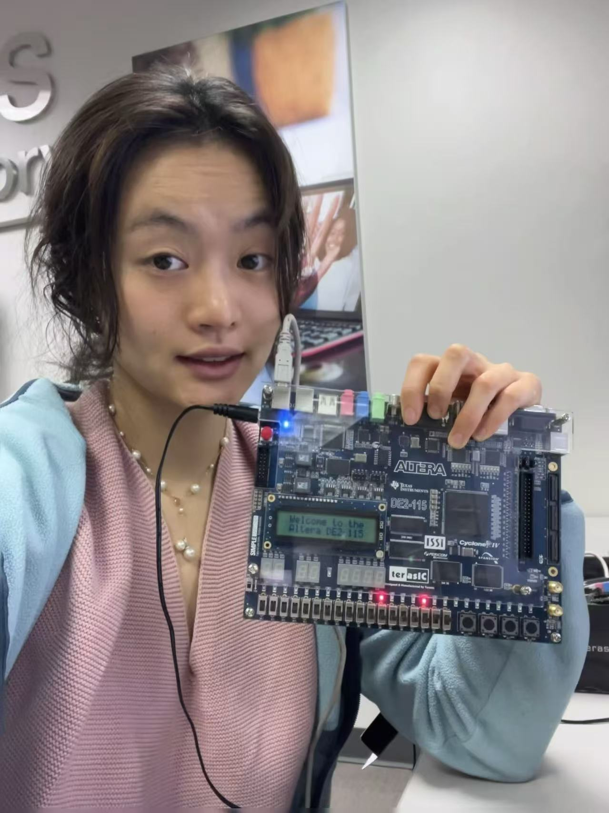

<table>
  <tr>
    <td style="width:180px; vertical-align:top;">
      
    </td>
    <td style="vertical-align:top; padding-left:20px;">
      <h1 style="margin-bottom:0;">
        Lynnix Zou 
        
          邹雀灵
        
      </h1>

      Undergraduate, Computer Engineering &amp; Computer Sciences 
      University of Wisconsin–Madison 
      Email: <a href="mailto:qzou24@wisc.edu">qzou24@wisc.edu</a> 
      Phone: <a href="tel:+16086218517">(+1) 608-621-8517</a> 
      CV: <a href="cv-Lynnix.pdf">cv-Lynnix.pdf</a> 
      LinkedIn: <a href="https://www.linkedin.com/in/lynnix-zou-1a294b302/">lynnixz</a>
    </td>
  </tr>
</table>

## About

I am an undergraduate student in Computer Engineering and Computer Sciences at the University of Wisconsin–Madison.  
My current research focuses on how transformers and large language models (LLMs) perform internal computation, especially on arithmetic and reasoning tasks. Before that, I studied Materials Science and Engineering at Sichuan University and worked on device physics and data-driven screening of electronic materials.

I have been working with Prof. Grigoris Chrysos since May 2024. I also collaborate with Prog. Kangwook Lee on topics related to LLM since Feb 2025.
I am broadly interested in:
1) in-ternal computation of transformers: how input formats and weight-space shape the algorithms that transformers learn and how fine-tuning alters those computations; and 
2) reasoning structure and internal state, understanding multi-step reasoning traces see what information models track over time and when that tracking fails. 

---

### Publication and Under review

- **Data Augmentations for Arithmetic Length Generalization in Small Transformers**  
  *Lynnix Zou; Muhammad H. Ashiq; Grigorios Chrysos.*  
  *Manuscript submitted to ICLR 2026 (under review). Workshop version accepted at the NeurIPS 2025 Workshop on Challenges in Time Series Data (WCTD).*
  Generalization is a central question in machine learning, and recent work shows that transformers struggle with length generalization even on basic arithmetic tasks such as addition. To address this, we designed
Aligned Blankspace Augmentation (ABA), a data format that zero-pads operands and inserts aligned blank spaces across numbers so that corresponding digits always share the same relative positions. With appropriate positional embeddings, ABA allowed small decoder-only transformers to achieve strong length generalization and outperform baselines on several arithmetic tasks.  
[Paper](https://openreview.net/forum?id=UZovxtlIym) · [Workshop](https://openreview.net/forum?id=02ujphOLxD) · [Poster](DataAugmentationPoster.pdf)

- **ReJump: A Tree-Jump Representation for Analyzing and Improving LLM Reasoning**  
  *Yuchen Zeng, Shuibai Zhang, Wonjun Kang, Shutong Wu, Lynnix Zou, Ying Fan, Heeju Kim, Ziqian Lin, Jungtaek Kim, Hyung Il Koo, Dimitris Papailiopoulos, and Kangwook Lee.*  
  Manuscript submitted to ICLR 2026 (under review).
  Multi-step reasoning has helped large language models (LLMs) achieve impressive success on challenging tasks, but a comprehensive understanding of reasoning behavior is still lacking. We represents a model's reasoning as a tree of partial solutions with a ``jump'' trace labeled by calculation, verification, and backtracking. Through this analysis, we show that \textbf{models arriving at the same answer may follow very different reasoning strategies.
  [Paper](https://openreview.net/forum?id=QOloPYGG2c)

---

### Ongoing projects

- **SLAM Benchmark for Belief Update in LLMs**  
  *Lead author.* LLMs are now widely used as the decision core of embodied agents in robotics, but it remains unclear whether they truly address the central state estimation problem of localization and mapping. To isolate memory and state estimation from vision and planning, we design a benchmark where the agent moves under partial and noisy observations, and the LLM must maintain beliefs about flags and its own location. We found that under noise their accuracy dropped far below the classical bayesian filter, showing that strong chain-of-thought alone is not enough without an explicit mechanism for state estimation
  
- **Group–Soup Testing for Detecting Misaligned Models**  
  *Lead author.* We explore model soups and group testing ideas as tools for detecting misaligned or backdoored models. By interpolating between models and designing grouped test queries, we aim to locate harmful behaviors with limited tests to the models.

## Teaching and Service

- Peer Mentor for ECE 532 (Machine Learning) at UW–Madison in Spring 2025, Summer 2025, Fall 2025.
